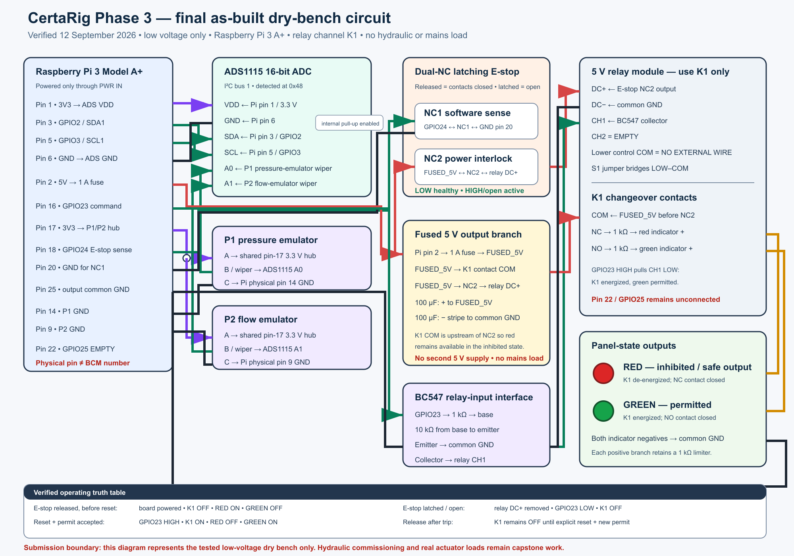

# Phase 3 — Implementation Readiness & Validation

---

## Cover Page

| Field | Value |
| --- | --- |
| Course Title | Study Project |
| Project Title | CertaRig: Agentic AI for Automated Commissioning and Revalidation of Engineering Test Rigs |
| Student Name | Chintan Dedhia |
| Student ID | 2023EB03005 |
| Project Advisor / Supervisor | Professor Raj Kumar |
| Date of Submission | 20 September 2026 |

---

## 1. Introduction

### 1.1 Purpose of Phase 3

Phase 3 asks whether CertaRig is ready to move from proof of concept to capstone development. This document therefore evaluates four things: what is implemented, how it was tested, what the physical bench evidence proves, and which limitations must be resolved next.

CertaRig is a test-operations platform for instrumented test benches ("rigs"). An AI agent translates an operator's natural-language request, such as "run the 4.2 bar pressure test," into an approved procedure. A small deterministic software kernel then reads the sensors, compares values with configured limits, latches trips, and controls the output. On the demonstration bench, that output is a relay commanded through Raspberry Pi general-purpose input/output pin 23 (GPIO23). Every run produces checksummed evidence. The central design question is therefore not "can an AI operate a rig?" but "who is allowed to authorize a physical output?" CertaRig's answer is the kernel, never the language model.

### 1.2 Summary of Work Completed So Far

**Phase 1 — problem definition and planning.** Phase 1 defined the problem: modern test benches combine sensors, manual procedures, relay outputs, spreadsheets, and screenshots; test records are hard to audit, and inserting a language model directly into the safety decision would be unacceptable. Phase 1 scoped a low-voltage dry bench (two potentiometers emulating pressure and flow, an ADS1115 analog-to-digital converter, a physical emergency stop, and a relay) as the demonstration target, and planned a staged path from observation to controlled actuation.

**Phase 2 — design and proof of concept.** Phase 2 produced the design and the proof-of-concept implementation: the `certarig_edge` package with the `ProcessGuardrail` safety kernel, the `DryBenchInterlock`, a live observe-only dashboard, procedure execution, and evidence writing. That proof of concept was validated incrementally on the bench (ADS1115 commissioning, potentiometer sweeps, dual-potentiometer sweeps, E-stop tests, and integrated bench runs recorded between 9 and 12 September 2026, retained under `pi_retrieval_2026-09-12/phase3_evidence/`). The PoC repository is frozen as the Phase 3 evidence source; the platform repository documented here was imported from it at commit `23988a3` and is where all further engineering happens (see `docs/PROVENANCE.md`).

**Phase 3 — implementation and validation (this document).** The PoC was developed into a deployable platform: Edge API, Studio operator console, digital twin, provider-neutral agent, and evidence pipeline. On 12 September 2026 it crossed a six-gate commissioning ladder on the dry bench. Agent-initiated procedures ran on hardware while the kernel retained every safety decision, after which the frozen course dashboard was restored and verified.

### 1.3 Advisor-frozen scope (meetings of 7 and 16 September 2026)

Phase 2 used the same cover identity (Study Project, student ID `2023EB03005`, Professor Raj Kumar) and already separated architecture, data flow, test cases, and a Phase 3 boundary. The meetings after Phase 2 froze what this report must show, and what it must not claim.

**7 September 2026 (scope freeze).** Professor Raj Kumar accepted the low-voltage Wave 1 electronic bench as the Phase 3 proof. Potentiometers may emulate pressure and flow. The water loop, real transducers, and final actuators are capstone work, not a 20 September requirement. A servo as a valve-position proxy is optional stretch only; it was not built. The professor asked the Phase 3 pack to include a circuit / schematic drawing, hardware photographs, a live local demonstration, top-level architecture and technology-stack visuals, named test cases, a new PoC video, the repository, and a conclusion that connects Phase 3 to the capstone. Claims must stay at laboratory breadboard readiness and be backed by measurements, logs, screenshots, photographs, and repeatable tests.

**16 September 2026 (video brief).** The professor asked for a beginner-friendly demonstration, originally up to 12 minutes, covering: who the end customer is; the exact AI choice with a use-case benchmark and a fallback; animation / context visuals; a stitched real PoC; technical explanation; and capstone missions. A later production instruction allowed 15–18 minutes when the live proof needed it. The submitted film is 13.4 minutes.

The table below is the Phase 2-style requirement trace. Every row is answered later in this document with evidence, not with a promise.

| Advisor request | Where this document answers it |
| --- | --- |
| Circuit / schematic of the built bench | Section 2.5; `docs/phase3/diagrams/CertaRig_Phase3_Final_AsBuilt_Circuit.png` |
| Bill of materials / hardware identity | Section 2.6; Robu invoice INV2627/225826; inventory register in `docs/phase3/` |
| Hardware photographs | 12 Sep evidence under `pi_retrieval_2026-09-12/phase3_evidence/`; top-down film |
| Live local demonstration | Section 3.2 (12 Sep six-gate lab); Section 9 film |
| Top-level architecture and technology stack | Section 2.4; Section 2.3 AI stack |
| Named test cases and results | Section 3.2 |
| PoC video (beginner-friendly, stitched bench proof) | Section 9; 13.4 min v4 film |
| End customer and application relevance | Section 7.1 |
| Exact AI choice, use-case benchmark, fallback | Section 2.2 / 2.3; Fake is proven; Claude then OpenAI are unproven live |
| Capstone missions and conclusion | Sections 7 and 10 |
| Water loop / real sensors / servo | Deferred; Section 6 items 4 and 8. Servo not fitted |
| Comparative live-LLM benchmark | Still unfulfilled; stated as a limitation, not as a result |

---

## 2. Implementation Overview

### 2.1 Implementation Status

**Fully implemented and validated:**

- Deterministic safety kernel (`certarig/edge/`): sensor quality checks, numeric limit comparison, trip latching, anti-restart, and exclusive ownership of the output (GPIO23 on the bench; a simulated output otherwise). The output invariant is: **OUTPUT = actuation enabled AND permit requested AND trip not latched AND E-stop closed AND process healthy.** Any unsafe sensor state, invalid quality, or open E-stop clears the permit and latches safe; recovery requires a healthy observation, an explicit reset, then a new permit.
- Edge HTTP API with capability-manifest filtering: this is the product control plane. The agent and Studio reach the rig only through this API, and dangerous operations (`bypass_interlock`, `override_limits`) do not exist as callable tools. Direct SSH GPIO commands and operator use of gpiozero are not the product path — gpiozero is the kernel's internal Raspberry Pi driver (the 12 September sidecar started with `GPIOZERO_PIN_FACTORY=lgpio`); SSH was a lab-host restore/halt convenience, not the operator or agent interface.
- Procedure library shipped as documented skills (`skills/`): relay truth table, pressure guardrail, flow guardrail, dual-input guardrail, emergency-stop anti-restart, ADC validation, thermal soak, and ops `safe_powerdown` — each a `SKILL.md`, a `procedure.yaml` contract, and simulator scenarios. The six electronics/process procedures are the 12 September hardware ladder; `safe_powerdown` is implemented and software-tested as the product shutdown path (it was not one of the six hardware runs — that day's halt was still improvised over SSH).
- Digital twin (`certarig/sim/`) with a scenario domain-specific language and invariant checks, plus the **twin gate**: a procedure whose hardware mode is `raspberry_pi` will not start unless the identical procedure hash has passed on the simulator within the previous 24 hours.
- Evidence pipeline: every run writes a CSV recording, `run.json`, `report.md`, and SHA-256 checksums; bundles export as checksummed zip archives naming the adapter class and hostname; run outcomes append to a ledger.
- Provider-neutral agent orchestrator (`certarig/agent/`) with the deterministic **Fake** provider as the default (rule-based, no API key — the provider used in all continuous integration and on the hardware bench), plus a replay capability for re-running transcripts exactly.
- Studio operator console (browser-based: Live, Onboard, Author, Procedures, Approvals, Agent, and Evidence views) and a Python SDK.
- Human-approval workflow: an agent cannot invoke `reset_trip` or `shutdown` without a human grant; an unapproved attempt receives HTTP 428 and deep-links to the Approvals view. The approved bench-off path is the `safe_powerdown` procedure, which commands the kernel to force safe first; the `shutdown` tool then refuses while a procedure is active, forces safe again, flushes evidence, and only then schedules power-off.

**Partially implemented (present in the tree, not yet validated end-to-end):**

- Live language-model adapters: Anthropic Claude Sonnet 4.5 (`certarig/agent/providers/anthropic_provider.py`, first choice because tool use is first-class) and OpenAI GPT-4.1-mini or any OpenAI-compatible endpoint (`openai_provider.py`, fallback). These adapters exist and are unit-tested, but they are **not** the proven bench path: the 12 September hardware procedures ran on the Fake provider, and no live-key operation has been validated.
- Fieldbus adapters: MQTT and Modbus TCP ship as real **observe-only** adapters; OPC UA, Siemens S7, EtherNet/IP, and CAN are targeted directions with observe-only examples, not validated integrations.
- Evidence export completeness: exported bundles reference each raw hardware CSV by filename, row count, and SHA-256 hash, but do not yet contain the CSV file itself (detailed in Section 6).

**Planned, not implemented:**

- The agent-led commissioning interview (design in `docs/platform-lab/commissioning-interview.md`): a stranger describes their bench, the agent proposes a `rig.json` map, a human applies it. Today's Onboard view is a writable configuration form with a typed bench briefing — useful, but a form, not discovery.
- Relay contact feedback or load-current sensing (needed before any end-to-end electrical trip-latency claim).
- Enterprise concerns: single sign-on, billing, NI-DAQ / PLC write paths.

### 2.2 Implemented Features

| Feature | Description |
| --- | --- |
| Safety kernel | Deterministic guardrail owning measurement, comparison, trip latching, and the physical output; enforces the five-condition output invariant |
| Edge API (control plane) | HTTP capability-manifest API; the only operator/agent path to the rig. Not SSH GPIO command, and not operator gpiozero |
| Six bench qualification procedures | ADC validation, relay truth table, pressure guardrail (4.2 bar), flow guardrail (15 L/min), dual-input guardrail, E-stop anti-restart; a thermal-soak skill is an additional simulator extension |
| Digital twin + twin gate | Simulator rehearsal required within 24 hours before the identical procedure hash may run on hardware |
| Agent orchestrator | Interprets operator language, selects an approved skill, starts the named procedure, waits for the deterministic result; never compares numbers |
| Provider neutrality | Fake (default, deterministic), Anthropic, OpenAI/compatible, and transcript replay behind one interface |
| Evidence bundles | Checksummed zip per pull; per-run CSV, `run.json`, `report.md`, events, checks, SHA-256 manifest; outcomes ledger |
| Studio console | Live dual-channel graphs with trip lines, ready-to-arm scorecard, onboarding config diff/apply, procedure authoring and approval, agent chat, evidence export |
| Approvals / shutdown | Agent requests for `reset_trip` and `shutdown` need a human grant; the approved bench-off path is `safe_powerdown` (kernel forces safe first), then the approved `shutdown` tool |
| Observe-mode adapters | MQTT and Modbus TCP observation of external tags/registers |
| Deployment | `make install` / Docker Compose simulator path for a stranger; `deploy/install_pi.sh` + systemd for a new Raspberry Pi (with guards refusing to run over the frozen Phase 3 host) |

### 2.3 Why This AI, Benchmarking, and Fallbacks

**Why use AI at all?** Test operators express intent in varied language, while rigs require exact procedure identifiers, units, and ordered steps. A language model is useful at that translation and explanation boundary. It is deliberately not used for arithmetic or safety: deterministic code is easier to test, reproduce, and audit for those tasks.

**Why these specific choices?** The proven runtime choice is **Fake**, a deterministic rule-based provider. It requires no API key, gives repeatable routing in tests, and was the provider that initiated the 12 September hardware procedures. For a future live interpreter, the first configured choice is **Anthropic `claude-sonnet-4-5`** because its API exposes tool use directly and the adapter maps CertaRig's provider-neutral tool schema to native tool-use blocks. The second choice is **OpenAI `gpt-4.1-mini`** through the OpenAI API; the same adapter can target an OpenAI-compatible endpoint through `OPENAI_BASE_URL`, including a local service. Transcript replay is a further deterministic regression option. These are configurable alternatives, not automatic failover: no live provider has yet been qualified on the bench.

The benchmark is specific to CertaRig, not a general chat or trivia score:

| Use-case criterion | Required behaviour | Current evidence |
| --- | --- | --- |
| Approved-skill routing | Map operator wording to the correct approved procedure | Fake routed the lab procedures; agent policy and orchestrator tests pass |
| Tool discipline | Call only tools exposed by the capability manifest | Enforced by manifest filtering and contract tests; dangerous tools remain unavailable |
| Safety-boundary discipline | Never compare live values or claim to make a trip decision | Fake transcripts show read skill → start procedure → wait → report kernel result |
| Human boundary | Stop for approval on `reset_trip` and `shutdown` | HTTP 428 approval flow is covered by contract tests |
| Reproducibility | Preserve and replay the complete interaction | Transcript and strict replay providers are implemented and tested |
| Provider comparison | Run the same prompt suite unchanged across candidates | Pending for Claude and OpenAI; live adapters are unit-tested only |

This benchmark establishes a clear admission rule for the capstone: Claude or the OpenAI fallback may assist on a real rig only after passing the same routing, tool, approval, refusal, and replay cases as Fake. Phase 3 validates the deterministic provider and the individual policy, approval, and replay mechanisms; it does **not** report a live-model comparison that was never run. That remaining gap is the one advisor request from 16 September that this report cannot tick.

### 2.4 System architecture

Phase 2 showed a browser review surface, a reasoning layer, and an independent safety policy over synthetic data. Phase 3 keeps that split and puts it on a real Raspberry Pi.

**Figure 1.** Operator / Studio describes intent. The agent selects an approved procedure and never compares a live number. The deterministic kernel validates sensor quality, compares limits, latches trips, and owns GPIO23. The rig (or the digital twin) is ADS1115 analogue emulators, a dual-NC emergency stop, and a low-voltage relay. OUTPUT is permitted only when actuation is enabled, a permit is requested, no trip is latched, the E-stop is closed, and the process is healthy.

Control and evidence flow, in order:

1. The operator speaks or types in Studio, or an agent session is opened.
2. The agent maps that language onto a named skill (`pressure_guardrail`, `flow_guardrail`, `safe_powerdown`, …) through the Edge HTTP API.
3. The twin gate refuses a hardware start unless the identical procedure hash passed on the simulator within 24 hours.
4. The kernel samples ADS1115 A0/A1, GPIO24 (E-stop sense), and its own latch state, then commands GPIO23.
5. Every run writes CSV, `run.json`, `report.md`, events, checks, and SHA-256 checksums.

The technology stack on the proven path is: Raspberry Pi 3 Model A+; Python Edge service; `gpiozero` with the `lgpio` pin factory as the kernel's internal driver (not an operator tool); Studio in the browser; Fake as the runtime agent. Claude Sonnet 4.5 and OpenAI GPT-4.1-mini are present as adapters and are not the proven bench path.

### 2.5 As-built circuit map

The drawing below is the **tested** 12 September dry-bench circuit, not a proposed sketch. It is the canonical as-built map asked for on 7 September. Source files: `docs/phase3/diagrams/CertaRig_Phase3_Final_AsBuilt_Circuit.svg` / `.png` / `.pdf`.

**Figure 2.** Raspberry Pi 3 Model A+, ADS1115 at I²C `0x48`, two 10 kΩ panel potentiometers as pressure (P1 → A0) and flow (P2 → A1) emulators, dual-NC latching E-stop, BC547 relay interface, 1 A fused 5 V branch, K1-only relay module, red inhibited lamp and green permitted lamp. No second 5 V supply. No mains, pump, valve, or hydraulic load.

Verified pin map (physical pin ≠ BCM number):

| Physical pin | BCM | As-built connection |
| --- | --- | --- |
| 1 | 3V3 | ADS1115 VDD |
| 2 | 5V | 1 A fuse → `FUSED_5V` |
| 3 | GPIO2 / SDA1 | ADS1115 SDA |
| 5 | GPIO3 / SCL1 | ADS1115 SCL |
| 6 | GND | ADS1115 GND |
| 9 | GND | P2 flow-emulator GND |
| 14 | GND | P1 pressure-emulator GND |
| 16 | GPIO23 | 1 kΩ into BC547 base (relay command) |
| 17 | 3V3 | Shared P1/P2 hub only |
| 18 | GPIO24 | E-stop NC1 sense (internal pull-up; raw LOW = healthy/released) |
| 20 | GND | E-stop NC1 return |
| 22 | GPIO25 | Unconnected |
| 25 | GND | Output / relay common |

Relay and indicators. S1 bridges LOW–COM. Relay lower/control COM has no external wire. CH2 is unused. K1 COM is fed from `FUSED_5V` **upstream of NC2** so the red lamp remains available when the E-stop has removed relay-board power. K1 NC → 1 kΩ → red (inhibited). K1 NO → 1 kΩ → green (permitted). Both lamp negatives return to common ground. E-stop NC2 sits in the relay DC+ feed: latched/open removes coil power independently of software.

Verified truth table from the 12 September integrated bench:

| Condition | Observed |
| --- | --- |
| E-stop released, before reset | Board powered; K1 off; red on; green off |
| Reset + permit accepted | GPIO23 HIGH; K1 on; red off; green on |
| E-stop latched / open | Relay DC+ removed; GPIO23 LOW; K1 off |
| Release after trip | K1 remains off until explicit reset + new permit |

Honesty notes that belong with the drawing: the inhibited lamp is **red** in this build (earlier inventory text said yellow for the same function). GPIO25 / CH2 were left empty on purpose. The optional broken-NC1 injection was **not** performed. Commanded GPIO23 is not a measurement of relay contact motion.

### 2.6 Bill of materials

Purchased hardware is Robu invoice **INV2627/225826** dated 4 September 2026 (17 physical product lines, inventory IDs R01–R17). Visual receipt was mapped to photographs IMG_1835–IMG_1850 on 6 September. Electrical acceptance and the as-built roles below are from the 9–12 September bench, not from the unboxing photos. The working register is `docs/phase3/CertaRig_Phase_3_Hardware_Inventory_Register_2026-09-06.md`.

**Installed on the 12 September as-built bench**

| ID | Item (as invoiced) | Qty on bench | As-built role |
| --- | --- | --- | --- |
| R16 | Raspberry Pi 3 Model A+ | 1 | Edge computer; kernel, Edge API, evidence |
| R13 | ADS1115 16-bit I²C ADC module | 1 of 2 | Pressure/flow analogue front-end at 0x48 |
| R15 | TE 23ESA 10 kΩ panel potentiometer | 2 of 3 | P1 pressure emulator, P2 flow emulator |
| R08 | LANBOO LB16SM 16 mm latching E-stop (2C-2NC) | 1 | NC1 software sense; NC2 relay-power interlock |
| R14 | 2-channel 5 V optocoupled relay module | 1 | K1 only; CH2 unused |
| R17 | BC547-TA NPN | 1 of 3 | GPIO23 → CH1 interface |
| R10 | Littelfuse 0217001.MXP 1 A, 5×20 mm | 1 of 5 | Fused 5 V output branch |
| R05 | BF-013A 5×20 mm fuse holder | 1 | Holds R10 |
| R01 | Green 3–9 V metal indicator | 1 | Permitted-state lamp (K1 NO) |
| R03 | MB102 830-point breadboard | 1 | Low-voltage interconnect |
| R04 | Rubycon 100 µF, 50 V electrolytic | 1 | Local bulk on `FUSED_5V` |
| R11 | 100 nF, 50 V disc capacitor | as required | Local ADC decoupling |
| R06 / R07 | 24 AWG silicone wire (red / green) | used | Labelled low-voltage wiring |

**Received, not in the as-built function, or spare**

| ID | Item | Status |
| --- | --- | --- |
| R02 | Yellow 3–9 V metal indicator | Received. As-built inhibited lamp is **red**, not this yellow part; same safe/inhibited function |
| R09 | ALPS RK09 10 kΩ rotary potentiometer (qty 3) | Development / spare; panel controls are R15 |
| R13 (spare) | Second ADS1115 | Spare module |
| R15 (spare) | Third TE panel pot | Spare / fault-injection stock |
| R12 | Murata 22 pF 0402 SMD (qty 6) | Parts stock; not required for Wave 1 |
| R17 (spares) | Remaining BC547 | Spares |
| R10 (spares) | Remaining 1 A fuses | Spares |

**Support stock used, not on the Robu invoice**

| Item | Role |
| --- | --- |
| Official 5 V, 2.5 A micro-USB Raspberry Pi supply | Pi PWR IN only |
| 32 GB Class 10 microSD | Pi OS |
| Dupont jumpers, labels, heat-shrink | Interconnect |
| 1 kΩ resistors (base + two lamp limiters) | Not a Robu line; existing lab stock. Amazon ELEGOO assortment was still pending on 6 Sep and is not claimed as the source |
| 10 kΩ resistor (base–emitter pulldown) | Same: existing lab stock |
| Red inhibited indicator | As-built lamp; not the yellow R02 metal indicator |

**Explicitly not purchased / not fitted (advisor freeze)**

- Wave 2 water loop, pump, real pressure transducer, pulse flow sensor, reservoir.
- Servo as valve-position proxy (7 September stretch item only).
- Separate extra 5 V rail for motors. The as-built output branch is the Pi 5 V pin through a 1 A fuse. No mains or high-current load.

---

## 3. System Validation and Testing

### 3.1 Testing Strategy

Validation is layered so that no procedure reaches hardware without having survived every cheaper layer first:

1. **Unit tests** (`tests/unit/`, 19 modules) — kernel state machine, guardrail predicates, procedure runner, evidence bundling, configuration and safety validation, simulator, twin gate, Raspberry Pi hardware abstraction.
2. **Contract tests** (`tests/contract/`) — the Edge, agent, ops, procedure, and simulator HTTP APIs against their schemas, including authentication and approval flows.
3. **Agent tests** (`tests/agent/`) — orchestrator policy, provider adapters, skill registry, and authoring; all CI paths use the Fake provider.
4. **Property-based tests** (`tests/property/`) — a Hypothesis state machine drives the kernel through arbitrary command/sensor sequences and asserts the output invariant and anti-restart property can never be violated.
5. **Scenario tests** (`tests/scenario/`) — every shipped skill scenario executes against the digital twin with invariant checks.
6. **End-to-end tests** (`studio/e2e/`, Playwright) — browser-level flows against `certarig sim serve`: the pressure-guardrail journey and Studio honesty checks (6 tests across 2 spec files; require Node 20).
7. **Digital-twin gate** — the operational enforcement that a hardware procedure hash must match a simulator pass from the last 24 hours.
8. **Hardware-in-the-loop** (`tests/hil/`) — bench tests that skip unless a live node reports `ready_to_arm`, plus `test_phase3_untouched.py`, which verifies the frozen Phase 3 dashboard was not altered.

`make check` (lint, types, unit/contract/agent/property/scenario at 90% coverage) never requires the Pi.

**Figure 3.** Gate 0 read-only; Gate 1 sidecar on port 8081; Gate 2 observe-only ADC; Gate 3 twin-gate stamps; Gate 4 five hardware procedures with the kernel owning GPIO23; Gate 5 restore the frozen Phase 3 dashboard and halt. This is controlled commissioning of a mapped rig, not autonomous discovery.

**Test-suite result observed for this document:** all 213 collected tests in the unit, contract, agent, property, and scenario suites passed (`python -m pytest tests/unit tests/contract tests/agent tests/property tests/scenario`, run 17 September 2026 in a fresh environment). The 2 hardware-in-the-loop tests collect but skip without the bench, and the 6 Playwright tests were not run in this environment (Node 20 not provisioned); their presence and scope are stated from the repository, not from an observed run.

### 3.2 Test Cases and Results

The decisive validation was the 12 September 2026 dry-bench lab, structured as six commissioning gates (Gate 0 through Gate 5). Results below are from the verified lab record (`docs/platform-lab/2026-09-12-dry-bench.md` and the evidence analysis in `docs/explainer/2026-09-13-gates-0-to-5-analysis.md`).

| # | Feature Tested | Expected Result | Observed Result | Status |
| --- | --- | --- | --- | --- |
| G0 | Read-only boundary inspection of the frozen Phase 3 system | Phase 3 tree present; no platform files in privileged locations | Phase 3 tree intact; no `/opt/certarig`; no `/etc/certarig/edge.env` | Pass |
| G1 | Isolated sidecar deployment | Platform serves from a separate folder and port with user-local config, without touching Phase 3 | Served from `~/certarig-platform` on port 8081; `install_pi.sh` never run; Phase 3 untouched on port 8080 | Pass |
| G2a | Observe-only ADC validation (first attempt) | Complete P1/P2 sweep within validation envelopes | **Failed** — the P1 (pressure) sweep was never raised and the channel went invalid; failure retained as evidence | Fail (retained) |
| G2b | Observe-only ADC validation (second attempt) | Complete sweep, both channels valid, output authority off | Passed: 1,291 samples over 129.0 s; peaks 8.10 bar / 17.67 L/min, inside the 10 bar / 20 L/min validation envelopes | Pass |
| G3 | Digital-twin gate | Six exact procedure hashes pass in simulation before hardware | All six simulator stamps recorded and matched by the hardware runs | Pass |
| G4a | Relay truth table (hardware, Fake agent initiated) | Reset, permit, safe, anti-restart command sequence | Passed 5 of 5 checks | Pass |
| G4b | Pressure guardrail (4.2 bar) | Crossing removes output and latches safe | Peak 4.83 bar; trip latched; software transition 0.608 ms | Pass |
| G4c | Flow guardrail (15 L/min) | Crossing removes output and latches safe | Peak 15.41 L/min; trip latched; software transition 0.801 ms | Pass |
| G4d | Dual-input guardrail | Pressure and flow independently trip the same output | Peaks 4.34 bar and 15.21 L/min; 9 of 9 checks passed | Pass |
| G4e | E-stop anti-restart | E-stop forces safe; release does not restart; permit before reset rejected | All observed as expected; software transition 0.867 ms | Pass |
| G5 | Restoration and clean exit | Phase 3 dashboard restored, actuation disabled, Pi halted | Sidecar stopped; Phase 3 back on port 8080 observe-only; `test_phase3_untouched` passed; actuation held disabled; Pi halted | Pass |
| S1 | Full software suite (this environment) | All non-hardware tests pass | 213/213 passed (unit, contract, agent, property, scenario) | Pass |

Aggregate hardware result: after the one retained observation failure, **six hardware runs passed, recording 3,422 samples and passing 34 of 34 evaluated checks**. All seven exported evidence archives and every file in their export manifests re-hashed successfully during the evidence review.

An honesty note on the millisecond figures: the sub-millisecond transitions are kernel-observed changes to the *commanded* GPIO state. They are **not** measurements of relay contact motion or electrical load removal — the current bench has no contact-feedback or current sensor (see Section 6).

### 3.3 Validation Summary

The evidence supports a narrow, defensible claim: CertaRig is a working evidence-first commissioning and test-operations runner for an already-mapped low-voltage rig. Specifically:

- The safety architecture behaved deterministically: every consequential hardware run contains the kernel events explaining why output was permitted or removed.
- Unsafe recovery was blocked in every case: pressure, flow, and E-stop runs all recorded a reset-required state and rejected a permit before reset.
- The two analog paths trip independently onto the same output.
- The agent remained outside the numeric safety boundary throughout: transcripts show the Fake agent reading a skill, starting a named procedure, waiting, and reporting the kernel's returned outcome — never comparing a measurement.
- Evidence integrity is inspectable: archive and file hashes verify.
- The failed first observation run is part of the validation, not a blemish: it demonstrates that a procedure refuses to pass when the operator action or signal quality is inadequate.

What is **not** validated: live LLM operation on hardware, discovery of an unmapped bench (including photo-to-control), write paths to industrial fieldbuses, and electrical (as opposed to software-commanded) trip latency.

---

## 4. Performance and Reliability

**Responsiveness.** Kernel-commanded safety transitions on the bench measured 0.608 ms (pressure trip), 0.801 ms (flow trip), and 0.867 ms (E-stop) from the kernel observing the condition to the commanded GPIO state changing — comfortably below any human-perceptible delay, with the caveat above that mechanical relay response is not yet instrumented. The Studio Live view streams both channels with trip lines in near real time; the observe run sampled at roughly 10 samples per second (1,291 samples over 129.0 s).

**Stability.** A Hypothesis property-based state machine generates arbitrary command orderings and sensor faults while continuously checking the output invariant and anti-restart rule. All 213 software tests in the stated suites passed in this environment; `make check` sets a 90% coverage threshold, and `make soak` runs one accelerated simulated hour. On hardware, six procedures completed without a kernel fault. The dual-input run also demonstrated trip → reset → permit → a second independent trip within one run.

**Resource usage.** The full stack (kernel, Edge API, Studio, evidence writer) ran as a user-local sidecar on a Raspberry Pi 3 Model A+ — a constrained single-board computer — alongside the frozen Phase 3 tree, while sampling two ADC channels and serving the browser console. No resource exhaustion was observed during the lab. The simulator path runs on any machine with Python 3.11+ (a stranger can go from clone to a running simulated rig in under ten minutes, or use Docker Compose).

**Bottlenecks and reliability risks.** The known constraints are: (a) exclusive hardware ownership — only one kernel may own GPIO23 and the ADS1115 at a time, which is by design but means no redundant observer; (b) the systemd `WatchdogSec=30` is a supervisor heartbeat, not a safety-integrity-level loop, so CertaRig must not be represented as a certified safety system; (c) evidence export currently omits the raw CSV payloads, limiting post-hoc waveform analysis from a pulled bundle; (d) relay state is command-derived, so a welded relay contact would not be detected by the current sensing set.

---

## 5. Risk Analysis

### 5.1 Identified Risks (Revisited)

| Risk (from earlier phases) | Phase 3 status |
| --- | --- |
| A language model makes or influences a safety decision | Architecturally excluded: the agent has no tool that compares measurements or drives the output; `bypass_interlock` / `override_limits` do not exist as callable tools; verified by transcripts and contract tests |
| Untested procedure reaches hardware | Mitigated by the twin gate: hardware start refused unless the exact procedure hash passed in simulation within 24 hours; enforced on all six 12 Sep runs |
| Output restarts after a trip or E-stop without human review | Mitigated by latching + anti-restart: permit-before-reset was rejected on the bench in the pressure, flow, and E-stop runs |
| Damaging the frozen Phase 3 course submission | Mitigated by the sidecar pattern (separate folder, port 8081, user-local env), install-script guards that refuse the Phase 3 host, and `test_phase3_untouched` — verified at Gate 0 and Gate 5 |
| Bad sensor data treated as good | Mitigated by sensor-quality checks: invalid quality clears the permit and latches safe; demonstrated by the failed first observation run |
| Evidence tampering or ambiguity | Mitigated by SHA-256 checksums on every artefact and export manifest; all seven archives re-verified. Residual gap: raw CSVs not yet inside the bundle |
| LLM provider outage or lock-in | Mitigated by provider neutrality: deterministic Fake default (no key), Anthropic first choice, OpenAI/compatible fallback, replay provider; CI never depends on a live model |
| Credential leakage | Mitigated by policy: keys live only in `.env` / `/etc/certarig/` / `~/.ssh`; operator keys ≥ 12 characters and distinct from the agent key; no secrets in `config/` |
| Improvised SSH / gpiozero shutdown as the operator path | Architecturally excluded from the product: the control plane is the Edge API; the approved bench-off path is `safe_powerdown` (kernel forces safe first) then human-approved `shutdown`. The 12 September SSH halt is recorded as lab restore, not the product interface |

### 5.2 Mitigation Effectiveness

The mitigations that were tested worked, and — importantly — they were tested by attempting the unsafe thing. The permit-without-reset rejection was exercised on hardware three separate times. The twin gate was not bypassed for convenience even under lab time pressure. The Gate 2 failure shows the quality mitigation firing in practice rather than existing only on paper. Two mitigations remain declared-but-untested at their edges: the live-LLM tool-discipline constraints have only been exercised through the Fake provider and unit tests (a live adapter has never driven the bench workflow), and the evidence-integrity story is weakened by the missing raw CSVs until the exporter fix and hash-verification contract test land.

---

## 6. Limitations

Stated plainly, because clarity here is worth more than optimism:

1. **Exported evidence bundles are incomplete.** Each hardware `run.json` records its raw CSV recording by filename, row count, and SHA-256 hash, but the pulled zip bundles do not contain the CSV itself. Metadata, events, checks, and outcomes are intact and the archive hashes match the lab record, but raw physical waveforms cannot be re-plotted from a pulled bundle. The stated next requirement is to include the recording in the export and add a contract test that opens an archive and verifies the CSV hash against `run.json`.
2. **No live language model has driven the proven path.** The 12 September hardware procedures used the deterministic Fake provider. Claude Sonnet 4.5 and OpenAI GPT-4.1-mini adapters exist and are unit-tested, but live-key operation is unvalidated. No claim is made — anywhere in this project — that an LLM tripped the relay.
3. **Software-commanded, not electrical, latency.** The sub-millisecond transition times are commanded-GPIO-state changes. Without an auxiliary contact, optocoupled feedback, or current sensor, end-to-end trip latency (and welded-contact detection) cannot be claimed.
4. **The bench is mapped, not discovered.** The commissioning interview is designed but not built; Onboard today is a configuration form with a bench briefing, not discovery. A photograph or circuit diagram may be sidecar context; it is never a control path. The proof covers one known Raspberry Pi dry bench.
5. **Fieldbus support is observe-only.** MQTT and Modbus TCP are real observe-mode adapters; OPC UA, Siemens S7, EtherNet/IP, and CAN are examples/directions. No write path to any industrial bus is implemented.
6. **Not a certified safety system.** The watchdog is a supervisor heartbeat, not a SIL loop; the bench is low-voltage; nothing here substitutes for certified safety instrumentation on a dangerous plant.
7. **Simulated and hardware traces are never interchangeable.** Simulator results are labelled as simulation, hardware results as Raspberry Pi, and this document maintains that separation throughout.
8. **Water loop, real transducers, and servo were frozen out of Phase 3.** The 7 September advisor meeting allowed potentiometer emulators and deferred hydraulic hardware to the capstone. The optional servo was not fitted. Phase 3 therefore does not claim a fluid process, a calibrated industrial sensor, or a valve-position actuator.

---

## 7. Future Enhancements / Capstone

### 7.1 End Customer, Industry Opportunity, and Enabling Advances

The end customer is not a general chatbot user. It is the owner or commissioner of a test bench: a lab engineer defining a qualification, a technician repeating it, or a team that needs an auditable record to survive a shift change. Phase 3's immediate customer context is a university dry bench, which the 7 September meeting accepted as the Phase 3 proof. The capstone target is a customer with an already-understood rig who wants safer guided operation and consistent evidence. A real water loop is one possible later validation case; it is not the definition of the product.

Relevant applications include hydraulic test carts, battery and vehicle benches on CAN, factory cells using Siemens or Allen-Bradley controllers, and Modbus skids. Electrification, connected industrial equipment, and increasingly software-defined products are the proposed growth drivers because they create more sensors, configurations, and repeatable verification work. Three technical advances make CertaRig timely: capable low-cost edge computers can run the kernel beside a rig; standard protocols such as MQTT, Modbus, OPC UA, and CAN expose structured signals; and tool-using language-model APIs can translate operator intent without being given output authority. Digital twins and inexpensive cryptographic hashing add rehearsal and auditable evidence. CertaRig combines those advances while keeping the safety decision deterministic. This is a product hypothesis, not a quantified market claim; capstone customer interviews must test it.

### 7.2 Summary of Capstone Missions

The capstone product is a **deployable agentic test-operations layer for someone else's mapped rig**. Its planned missions, in dependency order, are:

1. **Commissioning interview (the capstone product core).** The agent interviews the owner of a new rig — what modules exist, which bus (GPIO/ADC, MQTT, Modbus, OPC UA, S7, EtherNet/IP, CAN), which pin/register/tag maps to which concept, what trip numbers and units apply, what must remain observe-only — and proposes a `rig.json`. A human reviews and applies it; the twin rehearses the exact procedure; only then can an output be armed. This is deploy-on-someone-else's-mapped-rig, not photo-to-control: a diagram or photograph may be sidecar context, never permission to energize. The governing invariant: a new rig can be described in language and proposed as configuration, but no unreviewed mapping can ever reach an output.
2. **Second simulated plant.** Prove the interview against a different physics (for example a thermal plant, building on the existing `thermal_soak` skill and `rig.thermal.sim.json`) before any new physical output is energized.
3. **Evidence completeness.** Ship the exporter fix so bundles contain raw recordings, with the hash-verification contract test.
4. **Relay feedback / current sensing.** Add an isolated auxiliary contact or current sensor so electrical trip response can be measured, upgrading the latency claim from commanded to observed.
5. **Live-provider qualification.** Run `claude-sonnet-4-5` and `gpt-4.1-mini` through the Section 2.3 benchmark: approved-skill routing, capability-manifest discipline, no numeric safety decisions, correct approval stops, and replayable results. A live model remains optional and outside the kernel.
6. **Broader industry reach.** Extend observe-mode adapters toward factory OPC UA cells, battery and vehicle benches on CAN, and Modbus skids. Every new integration starts observe-only and uses a human-applied map.
7. **Calibrated sensing and protected actuation (advisor-deferred).** Replace the potentiometer emulators with real transducers, and — only after a human-applied map and a twin pass — consider a protected water-loop or valve case. A servo remains optional stretch, not a minimum.

### 7.3 Readiness to Move to the Capstone

CertaRig is ready for the capstone as a platform foundation, not as a finished industrial product. The kernel, Edge API, simulator gate, approvals, Studio workflow, and hardware procedure path exist and have evidence. The next work is therefore a bounded extension—commissioning a second mapped rig safely—rather than a redesign of the safety architecture. Readiness is conditional on preserving three rules: no unreviewed map reaches an output, simulated evidence is never presented as hardware, and no live model is admitted until it passes the use-case benchmark. Industrial sale or safety certification would require additional work beyond the capstone, including electrical output feedback, completed evidence export, broader hardware validation, and appropriate certified safeguards.

---

## 8. Learning Outcomes

- **Splitting interpretation from authority is the design, not a feature.** The most transferable lesson is architectural: the useful question was never whether the model is clever, but who may say yes. Making the kernel the only answer simplified every downstream decision, from tool design to evidence.
- **Failures are evidence.** Retaining the failed Gate 2 sweep, rather than re-running until clean, made the validation more credible, and demonstrated that procedures can refuse to pass.
- **Honesty about the AI stack matters.** The build-time coding assistant does not operate the product. At runtime, Fake is the proven deterministic path; Claude is the intended first live choice and OpenAI the fallback, but both remain unproven live. Keeping those roles separate prevented over-claiming and led to a benchmark based on skill routing and tool discipline rather than chat quality.
- **Commissioning discipline is a product feature.** The six-gate ladder (read-only, sidecar, observe, twin, actuate, restore) began as lab hygiene and turned out to be the product's user journey.
- **Restoration is part of success.** Leaving the frozen Phase 3 system exactly as found, verified by a test, taught that a credible result includes the exit, not just the demonstration.
- **Practical engineering breadth.** The project exercised embedded hardware (ADC, GPIO, E-stop wiring), safety-state-machine design, property-based testing, HTTP API and schema contracts, browser front-end work, deployment (systemd, Docker), and evidence/audit design in one system.

---

## 9. Final Deliverables

| Deliverable | Location / Status |
| --- | --- |
| Source repository | The `certarig-platform` repository (this tree): kernel, Edge API, twin, agent, Studio, skills, tests, deployment scripts. Frozen PoC: https://github.com/shadybrook/certarig-phase-2-poc |
| Frozen Phase 3 proof of concept | `certarig-phase-2-poc` at commit `23988a3`, frozen on the Pi as the submission evidence source (`docs/PROVENANCE.md`) |
| Deployed system | Frozen Phase 3 live dashboard on the bench Pi (port 8080, observe-only); platform reproducible via `make install && make check` + simulator, or Docker Compose |
| Documentation | `README.md`; `docs/platform-lab/` (product state, dry-bench lab record, commissioning-interview design); `docs/explainer/` (gates 0–5 evidence analysis); this Phase 3 document |
| As-built circuit map | `docs/phase3/diagrams/CertaRig_Phase3_Final_AsBuilt_Circuit.png` (also `.svg`, `.pdf`); Section 2.5 of this document |
| Bill of materials / inventory register | Robu INV2627/225826; `docs/phase3/CertaRig_Phase_3_Hardware_Inventory_Register_2026-09-06.md` (+ PDF); Section 2.6 |
| Evidence | Seven checksummed hardware bundles from 12 Sep 2026 (hashes in `docs/platform-lab/2026-09-12-dry-bench.md`); derived summary data in `docs/explainer/data/`; Phase 2 bench evidence in `pi_retrieval_2026-09-12/phase3_evidence/` |
| Evidence & product-direction report | `deliverables/CertaRig_Gates_0_to_5_Evidence_and_Product_Direction.pdf` (+ editable DOCX) |
| Presentation / demo material | **Phase 3 submission film v4** (13.4 min, paper explainer motion + designed Studio/bench split; atelier lookbook retired): [CertaRig_Phase3_Film.mp4](https://github.com/shadybrook/certarig-platform/releases/download/phase3-submission-videos-v4/CertaRig_Phase3_Film.mp4). **Uncut clap-synced bench run** (29.6 min, 1310+608 split, no overlay PiP): [CertaRig_Phase3_Uncut_Bench_Run.mp4](https://github.com/shadybrook/certarig-platform/releases/download/phase3-submission-videos-v4/CertaRig_Phase3_Uncut_Bench_Run.mp4). **Action windows** (no VO): [CertaRig_Phase3_Uncut_Action.mp4](https://github.com/shadybrook/certarig-platform/releases/download/phase3-submission-videos-v4/CertaRig_Phase3_Uncut_Action.mp4). Release page: https://github.com/shadybrook/certarig-platform/releases/tag/phase3-submission-videos-v4. Cut list: `tools/phase3_edit/edl/phase3_film_v4.json`. Motion: `python3 tools/render_phase3_explainer.py`. Source footage folder: https://drive.google.com/drive/folders/1mlegZnq_AQurnBIKY-Ckh1S6TyZ_Q8Bk |

---

## 10. Conclusion

Phase 3 demonstrates implementation readiness within a defined boundary. The core architecture—an agent that interprets while a deterministic kernel measures, compares, latches, and owns the output—was validated through a six-gate hardware progression. In this environment, 213 software tests passed. On 12 September, six exact procedure hashes passed the twin gate before six hardware runs recorded 3,422 samples and passed 34 of 34 checks. The 4.2 bar and 15 L/min guardrails latched safe, E-stop anti-restart held, and the frozen course system was restored and verified.

The result does not prove live-LLM operation, unknown-rig discovery (including photo-to-control), fieldbus actuation, mechanical relay latency, or a water loop. It also leaves raw CSV export incomplete. Those limits match the 7 September advisor freeze and define the capstone rather than weaken the Phase 3 result: build the commissioning interview, prove a second plant, complete evidence export, add electrical feedback, and qualify live providers. The project is ready to proceed on that bounded mission — deploy on someone else's already-mapped rig via a human-applied interview, while retaining the invariant that no unreviewed mapping can reach an output.

The AI can ask. Only the kernel can say yes.

---

## 11. Supervisor Review and Approval

**Supervisor Feedback:**

_________________________________________________________________

_________________________________________________________________

_________________________________________________________________

**Comments:**

_________________________________________________________________

_________________________________________________________________

**Recommendations:**

_________________________________________________________________

_________________________________________________________________

**Supervisor Signature:** ______________________________

**Date:** ______________________________
