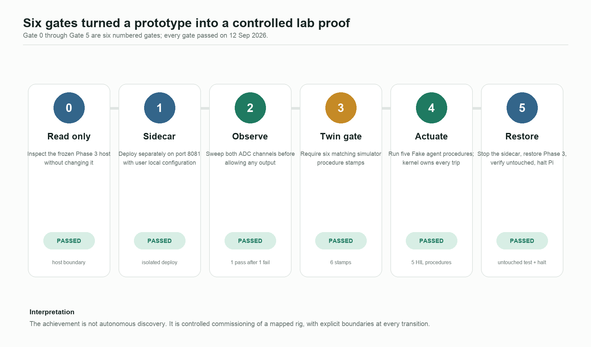
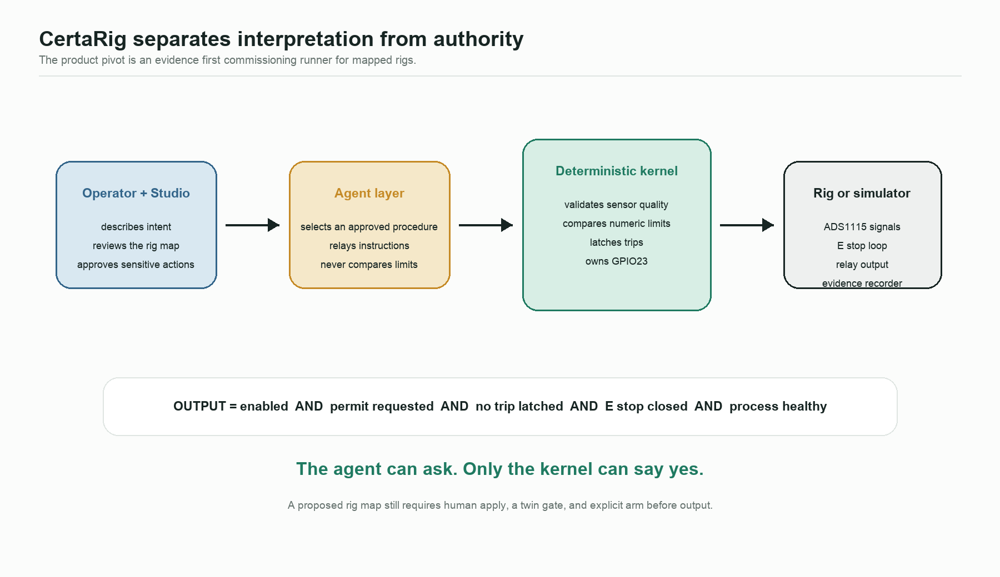
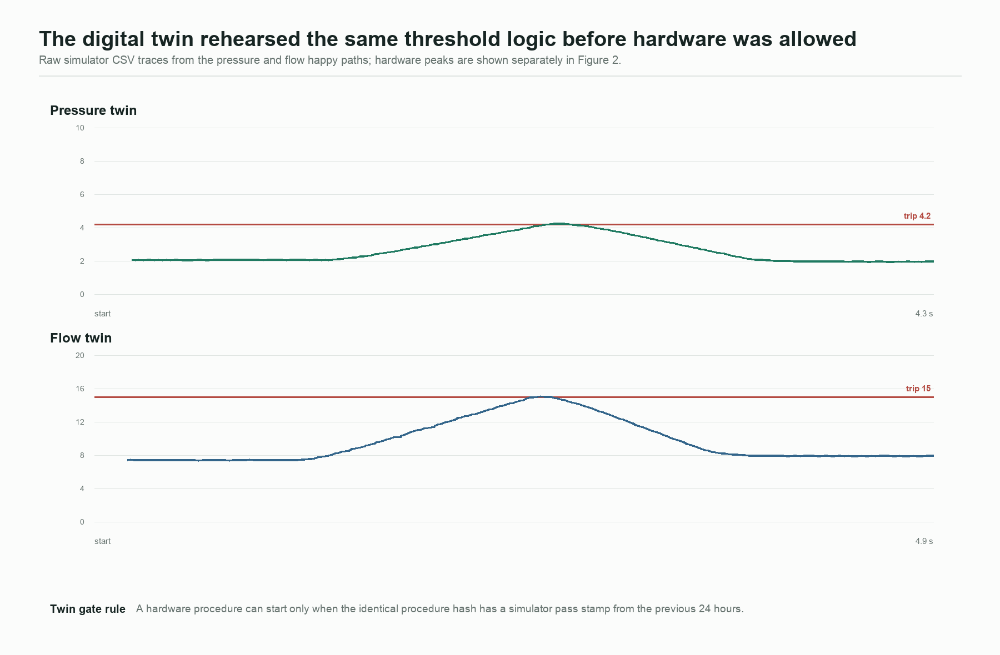
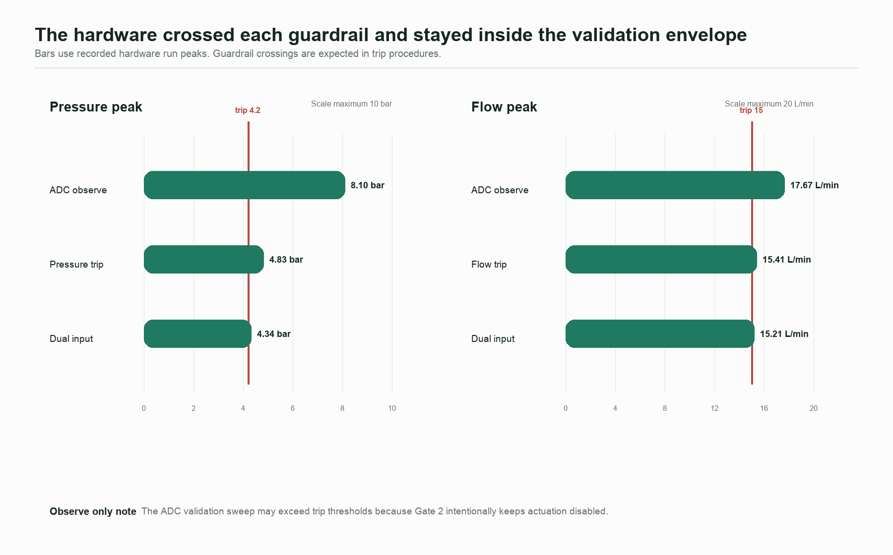
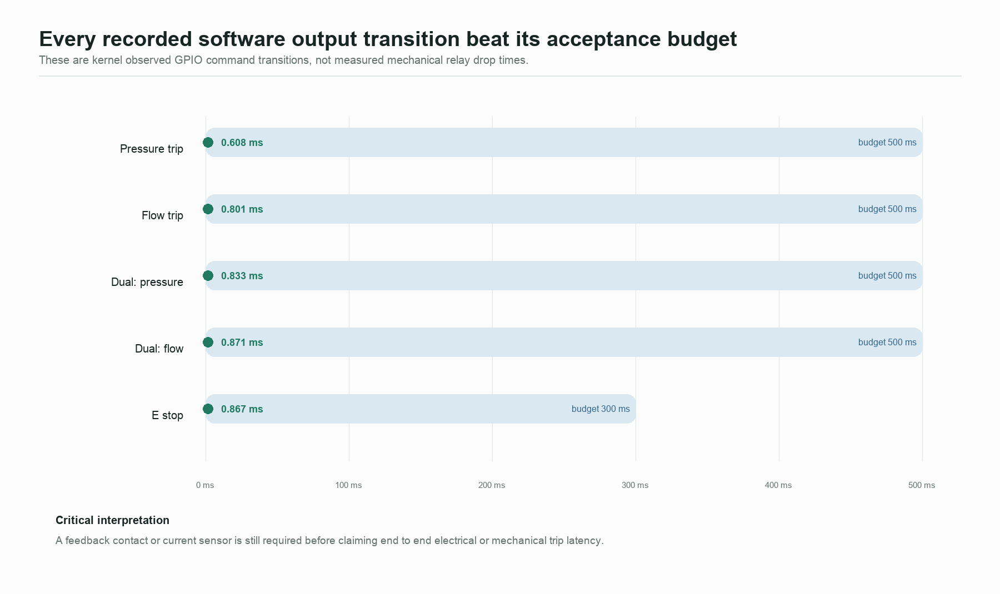
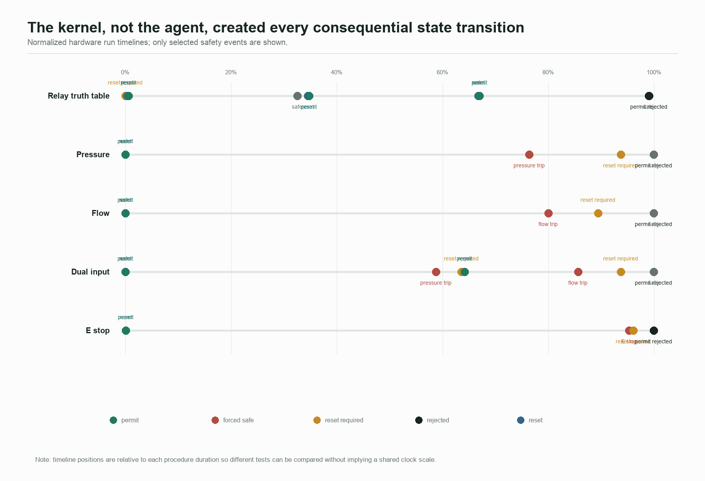
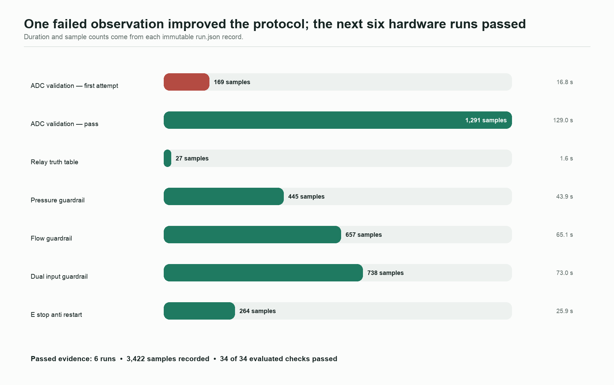

# CertaRig crossed the lab boundary without giving the agent control of safety

**Evidence review and product direction**
Prepared 13 September 2026 from the `CertaRig_CursorControl` repository and the 12 September dry bench evidence.

## Executive summary

CertaRig completed **Gate 0 through Gate 5**, which means six numbered gates. The sequence began with a read only inspection of the frozen Phase 3 system, introduced the new platform as an isolated sidecar, validated both ADC channels without output authority, required matching digital twin passes, ran five agent initiated hardware procedures, and finally restored the Phase 3 service and halted the Pi.

The evidence supports a narrow but valuable claim: **CertaRig is an evidence first commissioning runner for an already mapped low voltage rig.** It does not yet discover an unknown bench from a photograph or circuit diagram. The agent interprets operator intent and selects approved procedures. A deterministic kernel owns sensor quality checks, numeric comparisons, trip latching, and GPIO output.

After one expectedly useful failed observation run, **six hardware runs passed**, recording **3,422 samples** and passing **34 of 34 evaluated checks**. Pressure trips occurred at recorded peaks of **4.83 bar** and **4.34 bar** against a 4.2 bar guardrail. Flow trips occurred at **15.41 L/min** and **15.21 L/min** against a 15.0 L/min guardrail. The emergency stop test recorded forced safe, reset required after release, and rejection of a new permit before reset.

The platform is ready to be explained as a controlled commissioning loop. It is not yet ready to be sold as a universal autonomous hardware agent.



## The problem CertaRig is solving

Modern test benches often combine sensors, manual procedures, relay outputs, spreadsheets, and screenshots. An AI assistant can make the interface easier, but allowing a language model to directly decide whether a measurement is safe creates an unacceptable ambiguity. The important design question is therefore not “Can an agent operate a rig?” It is:

> Who is allowed to say yes when a physical output may be energized?

CertaRig answers by splitting interpretation from authority. The operator and agent work in language. The kernel works in explicit state, units, limits, and invariants.

The actual output condition implemented by `ProcessGuardrail.drive_high` is:

```text
output = actuation enabled
      AND permit requested
      AND trip not latched
      AND emergency stop closed
      AND process healthy
```

Any unsafe sensor state, invalid quality, or open emergency stop clears the permit and latches the safe state. Recovery requires a healthy observation, then an explicit reset, then a new permit.



## What each gate established

### Gate 0: read only boundary inspection

The first gate established that the existing university Phase 3 tree was present and that the product platform had not been installed into privileged production style locations. The inspection found no `/opt/certarig` installation and no `/etc/certarig/edge.env`. This was a change control gate, not a functional test.

**Meaning:** the new product work began without silently altering the submission system.

### Gate 1: isolated sidecar deployment

The platform was copied to a separate user directory and served on port 8081 with a user local environment. The deployment script intended for a new Pi was not run. Phase 3 remained on its own directory and port.

**Meaning:** two software worlds could coexist without competing for files or service identity. GPIO ownership was still exclusive: only one kernel could own GPIO23 and the ADS1115 at a time.

### Gate 2: observe before actuation

The ADC validation procedure was run with actuation disabled. The first attempt failed because the expected P1 sweep was not completed and the pressure channel became invalid. That failure was preserved rather than hidden. The second attempt passed after a complete P1 and P2 sweep.

The passing run recorded **1,291 samples** over **129.0 seconds**, with peaks of **8.10 bar** and **17.67 L/min**. Both stayed inside their configured validation envelopes of 10 bar and 20 L/min. Crossing the later trip thresholds during this gate was acceptable because output authority was disabled.

**Meaning:** CertaRig proved that observation and data quality come before permission to energize. The failed attempt is evidence that a procedure can refuse to pass when the operator action or signal quality is inadequate.

### Gate 3: digital twin gate

Six simulator procedures were run and stamped: ADC validation, relay truth table, pressure guardrail, flow guardrail, dual input guardrail, and emergency stop anti restart. Each hardware procedure hash had to match a simulator pass from the previous 24 hours.

**Meaning:** the hardware procedure was not improvised at the bench. The exact procedure contract had already crossed the same logical path in the twin.



### Gate 4: controlled hardware actuation

The Fake agent selected approved procedures and relayed instructions. It did not compare measurements. Five hardware procedures passed:

| Procedure | What it proved | Recorded result |
| --- | --- | --- |
| Relay truth table | Reset, permit, safe, and anti restart command sequence | Passed 5 of 5 checks |
| Pressure guardrail | Pressure crossing removes output and latches safe | Peak 4.83 bar; software transition 0.608 ms |
| Flow guardrail | Flow crossing removes output and latches safe | Peak 15.41 L/min; software transition 0.801 ms |
| Dual input guardrail | Pressure and flow independently trip the same output | Peaks 4.34 bar and 15.21 L/min; 9 of 9 checks passed |
| Emergency stop anti restart | E stop removes output; release does not restart it | Software transition 0.867 ms; permit rejected before reset |

The plotted transition times are kernel observed changes to the commanded GPIO state. They are **not** measurements of relay contact motion or electrical load removal, because Wave 1 has no contact feedback or current sensor.







### Gate 5: restoration and clean exit

The sidecar service was stopped, the Phase 3 dashboard was restored on port 8080 in observe only mode, `test_phase3_untouched` passed, actuation was held disabled, and the Raspberry Pi was halted.

**Meaning:** success included leaving the previous system in its expected state. Restoration was part of the commissioning proof, not an afterthought.

## What the data says



The evidence supports five conclusions.

1. **The safety architecture behaved deterministically.** Every consequential hardware run includes the kernel events needed to explain why output was permitted or removed.
2. **Unsafe recovery was blocked.** Pressure, flow, and emergency stop procedures all recorded a reset required state and rejected a permit before reset.
3. **The two analog paths worked independently.** The dual input run tripped once on pressure, recovered through reset and permit, then tripped separately on flow.
4. **The agent remained outside the numeric safety boundary.** The stored transcripts show the Fake agent reading a skill, starting a named procedure, waiting for the deterministic result, and reporting the returned outcome.
5. **Evidence integrity is inspectable.** All seven exported zip archives and every file listed in their export manifests were rehashed successfully during this report build.

## The product pivot

The strongest product is not “an AI that can understand any machine from a diagram.” That claim would be ahead of the evidence. The defensible pivot is:

> **CertaRig is an evidence first commissioning and test operations layer for mapped rigs. It lets an agent guide work while a deterministic kernel retains authority over measurements, interlocks, outputs, and evidence.**

The user journey becomes:

1. Describe the bench and map its known signals.
2. Let the platform propose a `rig.json` configuration.
3. Require a human to review and apply the map.
4. Observe signals with all outputs disabled.
5. Run the identical procedure in a digital twin.
6. Explicitly arm the real output.
7. Execute the controlled procedure.
8. Export a checksummed evidence bundle.

The next product experiment should be a thin commissioning interview on the simulator. It should ask what modules exist, what each signal means, which units and trip limits apply, and what must remain observe only. Its output is a proposed configuration, never automatic permission to energize.

## Evidence limitations and corrective actions

### Raw hardware recordings are referenced but not exported

Each hardware `run.json` records the CSV filename, row count, and SHA256 hash, but the pulled zip bundles do not contain the recording CSV itself. The metadata, events, checks, and run outcomes are intact, and the seven archive hashes match the lab record. However, raw physical waveforms cannot be replotted from the pulled bundles.

**Correction:** update the evidence exporter to include each run’s recording CSV, then add a contract test that opens an exported archive and verifies the CSV hash against `run.json`.

### Relay state is command derived

The platform knows the GPIO command and the expected relay state. It does not sense the relay contact or load current.

**Correction:** add an isolated auxiliary contact, optocoupled feedback input, or current sensor before claiming end to end trip latency.

### The bench is mapped, not discovered

The current proof uses one known Raspberry Pi dry bench. MQTT and Modbus adapters are observe mode test doubles. Live OpenAI or Anthropic operation is not validated; the default is the deterministic Fake provider.

**Correction:** prove the commissioning interview with a second simulated plant, then a second mapped physical rig. Keep live language models optional and outside the safety kernel.

## Recommended next milestone

Build the simulator first commissioning interview and prove this invariant:

> A new rig can be described in language and proposed as configuration, but no unreviewed mapping can reach an output.

That milestone would turn the current technical proof into a clearer product story without weakening the boundary that made the lab result credible.

## Reproducibility and provenance

Primary local sources:

- `docs/platform-lab/2026-09-12-dry-bench.md`
- `evidence/lab-pulled/*/procedure_runs/*/run.json`
- `evidence/lab-pulled/*/procedure_runs/*/events.jsonl`
- `evidence/lab-pulled/*/export_manifest.json`
- `evidence/sim-library/*/*.csv`
- `evidence/sim-library/twin_gate/*.json`
- `evidence/agent_transcripts/*.jsonl`
- `certarig/edge/commissioning.py`

Derived files:

- `data/hardware_run_summary.csv`
- `data/evidence_verification.json`
- `assets/01_gate_ladder.png` through `assets/07_product_architecture.png`

Relevant GBrain pages used to locate and interpret the source material:

- `projects/certarig-platform`
- `projects/certarig-platform-dry-bench-2026-09-12`
- `projects/certarig-platform-kernel`
- `projects/certarig-platform-studio`
- `projects/certarig-platform-adapters`
